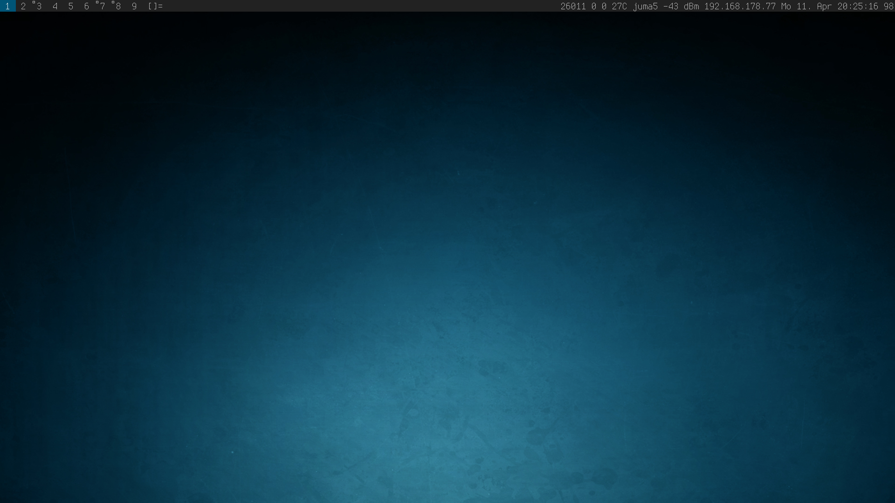
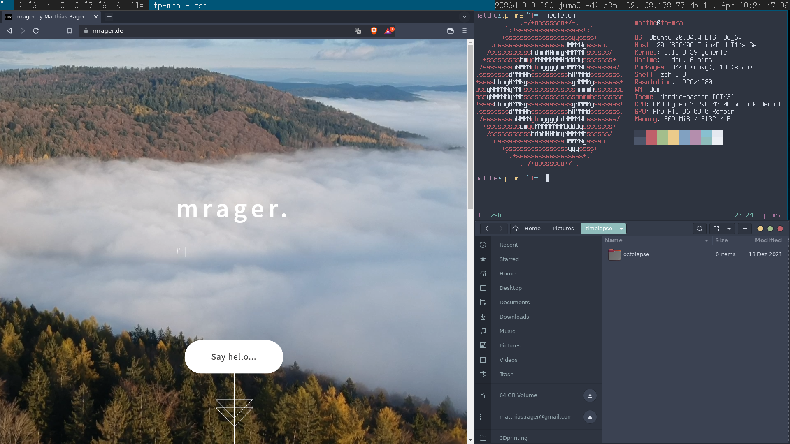

# DOTFILES **arch**pad  
(Lenovo ThinkPad T14s Gen 1 AMD)




## CLONE REPO
```
$ git clone ...
```

### CREATE SYMLINKS
```
$ ln -s ....
``` 

e.g.

```
$ ln -s ~/dotfiles/vim/vimrc.symlink ~/.vimrc
```

## SUCKLESS DWM ON UBUNTU (20.04 LTS)
Lenovo ThinkPad T14s AMD

```
$ sudo apt-get install build-essential libx11-dev libxinerama-dev sharutils suckless-tools

$ git clone https://git.suckless.org/dwm ~/.suckless/dwm

$ sudo make clean install
```

Ubuntu Display Manager gdm3
```
$ sudo apt install dwm
$ sudo mv /usr/share/xsessions/dwm.desktop /usr/share/xsessions/dwm.desktop.bak
$ sudo apt purge dwm
$ sudo mv /usr/share/xsessions/dwm.desktop.bak /usr/share/xsessions/dwm.desktop
```

```
Desktop Entry]
Encoding=UTF-8
Name=Dwm
Comment=Dynamic window manager
# Exec=dwm
Exec=/home/matthe/.xinitrc
Icon=dwm
Type=XSession

```

### Brightness Button
```
$ sudo vim /etc/sudoers
```
-->
```
%sudo   ALL=(ALL) NOPASSWD:/home/matthe/dotfiles/bin/brightness
%sudo   ALL=(ALL) NOPASSWD:/sys/class/backlight/amdgpu_b10/brightness
```

### FSCREENSHOT

```
$ sudo apt install flameshot
$ mkdir -p ~/Pictures/screenshots
$ sudo chmod 777 ~/Pictures/screenshots
$ sudo ln -s /home/dotefiles/XXX/bin/fscreenshot /usr/bin/fscreenshot
``` 

### TOUCHPAD
activate natural scrolling
https://www.topbug.net/blog/2017/02/23/enable-natural-scrolling-for-trackpads-using-libinput/

```
$ xinput 
$ xinput --list
$ xinput --list-props "ETPS/2 Elantech Touchpad"
$ xinput --set-prop "ETPS/2 Elantech Touchpad" "libinput Natural Scrolling Enabled" 1
```

--> ~/.xinitrc
```
# activate tapping
xinput set-prop "ETPS/2 Elantech Touchpad" "libinput Tapping Enabled" 1
# activate natural scrolling
xinput set-prop "ETPS/2 Elantech Touchpad" "libinput Natural Scrolling Enabled" 1
# speed up touchpad
xinput set-prop "ETPS/2 Elantech Touchpad" "libinput Accel Speed" 0.4
```
### TRACKPOINT
slow down trackpoint speed

--> ~/.xinitrc
```
# slow down trackpoint speed
xinput set-prop "ETPS/2 Elantech TrackPoint" "libinput Accel Speed" -0.5
``` 

### SCREEN / DISPLAY TEARING
--> ~/.xinitrc
```
xrandr --auto
...
# picom & # try fix tearing
xrandr --output eDP --set TearFree on
``` 

### DARK THEME GLOBALLY

If you're not using gnome or xfce but have some gtk apps installed then you could always set your theme preferences.
Edit the file `~/.config/gtk-3.0/settings.ini` and set `gtk-application-prefer-dark-theme=1` 
Edit the file `~/.config/gtk-4.0/settings.ini` and set `gtk-application-prefer-dark-theme=1` 

``` 
[Settings]
gtk-theme-name=Nordic-master
gtk-application-prefer-dark-theme=0
``` 

https://www.youtube.com/watch?v=3jvFpYaSoPo
https://varunbpatil.github.io/2013/09/28/dwm.html


### ST / TMUX: GERNERAL

#### FONT SIZE

To change font size use `STRG + SHIFT + pgup` or `STRG + SHIFT + pgdown`

#### COPY & PASTE

1. `<tmux prefix> + ESCAPE`. e.g. `STRG+A, ESCAPE`
  (wait a second before hitting ESCAPE. in the left bottom corner you will see [tmux] mode instead of zsh)
1. navigate the copy mode with vi-like-keypindings
1. select with `v`
1. yank with `y`
1. paste with `<tmux prefix> + p`

https://www.rockyourcode.com/copy-and-paste-in-tmux/
https://www.rushiagr.com/blog/2016/06/16/everything-you-need-to-know-about-tmux-copy-pasting-ubuntu/

paste from clipboard into st by using `STRG + SHIFT + V`

#### COPY & PASTE clipmenu, tmux-yank

Install clipmenu

```  
cd ~/.suckless
git clone https://github.com/cdown/clipnotify.git
cd clipnotify
sudo make
sudo make install

cd ~/.suckless
git clone https://github.com/cdown/clipmenu.git
cd clipmenu
sudo make
sudo make install
```  
Install [Tmux Plugin Manager](https://github.com/tmux-plugins/tpm) and [tmux-yank](https://github.com/tmux-plugins/tmux-yank).

More [info](https://www.seanh.cc/2020/12/27/copy-and-paste-in-tmux/)

Usage
```
Selecting text with the mouse copies it into the primary selection
Choose from clipmenu by dwm Modky+Insert `Win+Insert`
```

### MAP KEYS

Step 1 (mapping caps_lock + hjkl): 
Create a file (say "~/.xmodmap") with the following content:
```
keycode 66 = Mode_switch
keysym h = h H Left
keysym l = l L Right
keysym k = k K Up
keysym j = j J Down
keysym u = u U Prior
keysym i = i I Home
keysym o = o O End
keysym n = n N Next
```

Run xmodmap ~/.xmodmap.

Step 2 (caps_lock as escape): Run `xcape -e 'Mode_switch=Escape'`.

Step 3 (optional): To avoid manually applying the keybindings, put the above 2 commands into your zshrc file.


### PASS PASSWORD STORE

```
sudo apt install -y pass
cd /usr/local/bin
wget https://git.zx2c4.com/password-store/plain/contrib/dmenu/passmenu

```

[ more ](https://www.passwordstore.org)  
[ more ](https://ryan.himmelwright.net/post/setting-up-pass/)
